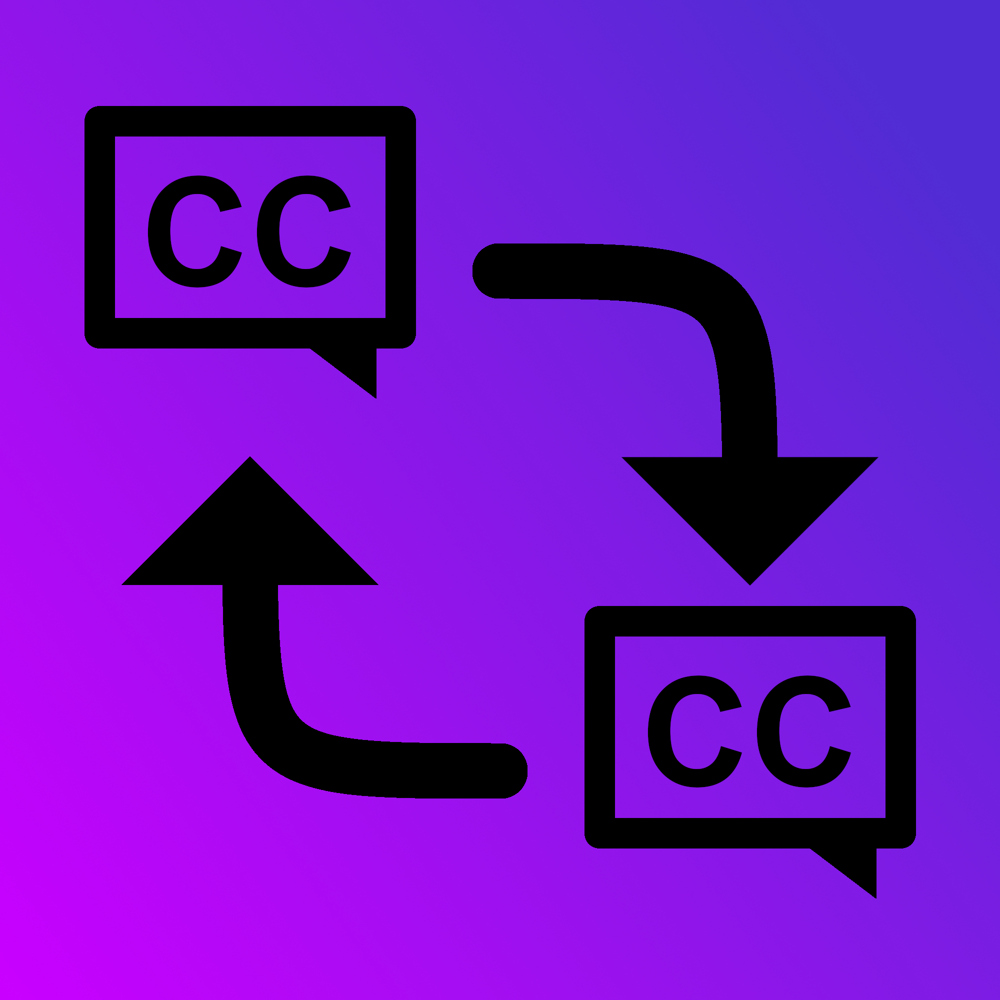

<h1 align="center"> 
    DotnetSubtitleConverter 
</h1>

<p align="center">
    Simple class library, that can be used to convert subtitle files to other subtitle formats
</p>

<p align="center">
  
</p>

## Supported subtitle formats
- SRT
- VTT

## Usage
```
string output = SubtitleConverter.ConvertTo(example_SRT_file_path, SubtitleConverter.SubtitleType.VTT)
StreamWriter sw = new StreamWriter(output_vtt_path);
sw.WriteLine(output);
sw.Close();
```
## subtitleType

SubtitleConverter.SubtitleType is enum, that contains all of the subtitle types (that are supported). 

## TODO

- [ ] more subtitle types
- [x] offset feature
- [ ] integration tests should verify outputs.
- [ ] more unit tests 
- [x] custom exceptions
- [ ] nuget package
- [ ] cd pipeline

## How to contribute

### Adding new subtitle type

1. Add the subtitle type to ```SubtitleType``` enum in ```SubtitleConverter.cs```.

2. Create **public static** class in ```./DotnetSubtitleConverter/Subtitles/``` for the subtitle type and create the following public methods:
    - GetSubtitleData()
    - GetConvertedString()
    - Check()
      
    This class can and should have private helper methods, but instead of making these methods private make them internal. SubtitleConverter project has set internal functions to be visible for ```Tests``` project. This makes unit testing possible for these helper functions.

3. In ```SubtitleConverter.cs``` Within ```ConvertTo()``` function, add your subtitle format's ```GetSubtitleData()``` To the first switch statement and the ```GetConvertedString()``` to the second switch statement.

4. In ```SubtitleConverter.cs``` Within ```GetSubtitleType()``` function, add your subtitle format's check function in to the switch statement.

**Note** ```CommonUtils.cs``` may contain useful helper functions.
