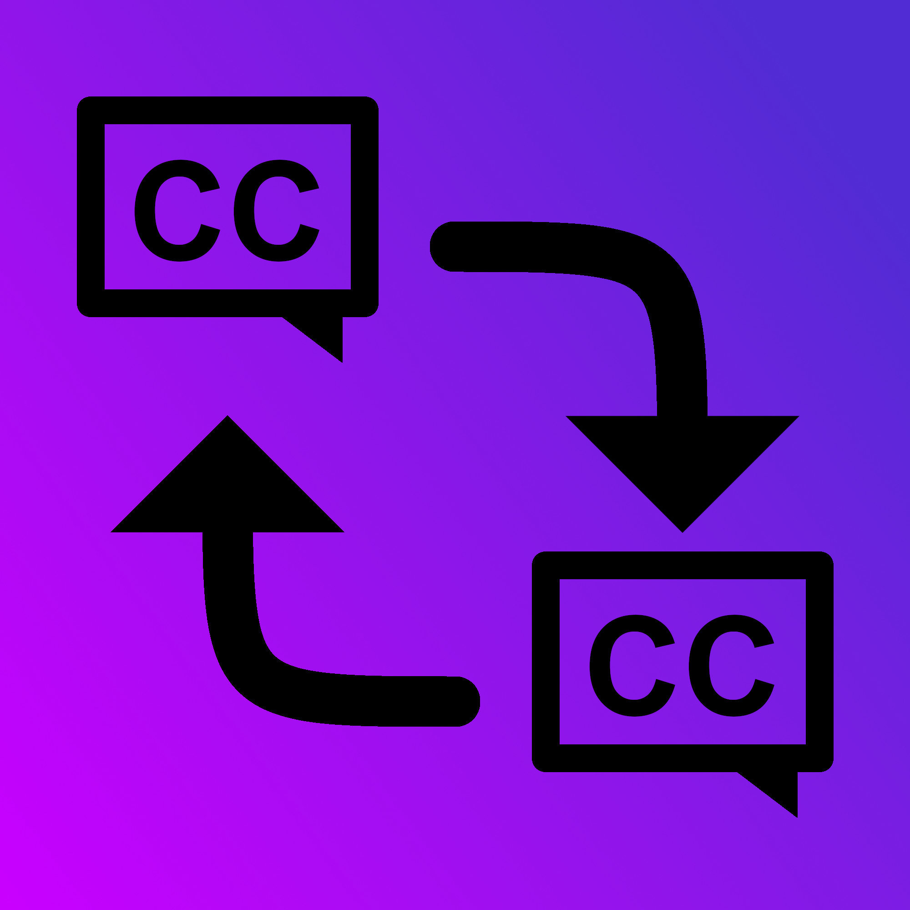

<h1 align="center"> 
    DotnetSubtitleConverter 
</h1>

<p align="center">
    Simple class library, that can be used to convert subtitle files to other subtitle formats and offset subtitle timings
</p>

<p align="center">
    <a href="https://github.com/Arttu05/DotnetSubtitleConverter/actions/workflows/RunTests.yml">
        
    </a>
</p>

<p align="center">
  
</p>

## Supported subtitle formats
- SRT
- VTT
- SBV
- ASS

## How to add to your project

1. Clone this repository.
2. build with following command ```dotnet build --configuration release```, while your working directory is in this project's root. 
3. Now you should find the .dll file from ```./DotnetSubtitleConverter/bin/Release/net8.0/DotnetSubtitleConverter.dll```. Copy the path of the dll
4. Add reference to the dll
   - With visual studio: [follow this instruction from stackoverflow](https://stackoverflow.com/a/65017892)
   - manually:
     Add the following string to your projetc's ```.csproj``` file and replace the path with your path </br>
     ```
          <ItemGroup>
            <Reference Include="DotnetSubtitleConverter">
              <HintPath>./your/path/to/the/dll</HintPath>
            </Reference>
          </ItemGroup>
     ```

## Usage

```SubtitleConverter``` library offers following functions: 

### ```string ConvertTo(string filePath, SubtitleType subtitleType, int msOffset = 0, bool returnOnOffsetOverflow = false)``` </br>
Reads given file and returns the converted subtitle as a string.

Parameters: </br>
```filePath```: path to the file you want to convert. </br>
```subtitleType```: to what format the subtitle gets converted to. </br>
```msOffset``` \<optional\>: offset subtitle timings in milliseconds. Can be a negative number. </br>
```returnOnOffsetOverflow``` \<optional\>: If true and offset makes subtitle timestamp negative, library will throw exception. While false and offset makes timestamp negative, will make the stamp 0. 


Example usage: </br>
```
string output = SubtitleConverter.ConvertTo("./example.srt", SubtitleConverter.SubtitleType.VTT)
StreamWriter sw = new StreamWriter(output_vtt_path);
sw.WriteLine(output);
sw.Close();
```

### ```SubtitleType GetSubtitleType(string filePath)``` </br>

Returns the type of the given subtitle.


## subtitleType

SubtitleConverter.SubtitleType is enum, that contains all of the subtitle types (that are supported). 

## Exceptions 

- OffsetOverFlowException
- InvalidSubtitleException

## TODO

- [ ] more subtitle types
- [x] offset feature
- [x] integration tests should verify outputs.
- [x] more unit tests 
- [x] custom exceptions
- [ ] nuget package
- [ ] cd pipeline

## How to contribute

### Adding new subtitle type

1. Add the subtitle type to ```SubtitleType``` enum in ```SubtitleConverter.cs```.

2. Create **public static** class in ```./DotnetSubtitleConverter/Subtitles/``` for the subtitle type and create the following public methods:
    - ```GetSubtitleData(ref StreamReader reader)``` </br>
          This function should parse the given file to ```List<SubtitleData>``` and then return the ```List<SubtitleData>``` .
          ```reader``` is a StreamReader that is at the begining of the given file. </br>
          **Returns** ```List<SubtitleData>```
      
    - ```GetConvertedString(List<SubtitleData> subtitleData)``` </br>
           Creates subtitle from ```List<SubtitleData>```. </br>
           **Returns** ```string```
    
    - ```Check(ref StreamReader reader)``` </br>
          Parses the given file with ```reader```. Used by ```GetSubtitleType()``` to figure out what subtitle format the given file is. </br>
          **Returns** ```bool```, that indicates whether the given file is valid subtitle file. 
      
    This class can and should have private helper methods, but instead of making these methods private make them internal. SubtitleConverter project has set internal functions to be visible for ```Tests``` project. This makes unit testing possible for these helper functions.

3. In ```SubtitleConverter.cs``` Within ```ConvertTo()``` function, add your subtitle format's ```GetSubtitleData()``` To the first switch statement and the ```GetConvertedString()``` to the second switch statement.

4. In ```SubtitleConverter.cs``` Within ```GetSubtitleType()``` function, add your subtitle format's check function in to the switch statement.

**Note** ```CommonUtils.cs``` may contain useful helper functions.
